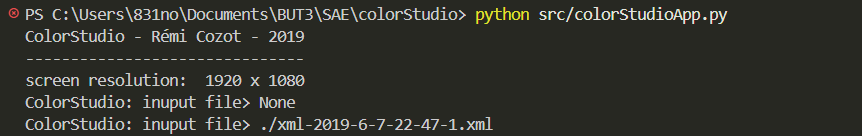
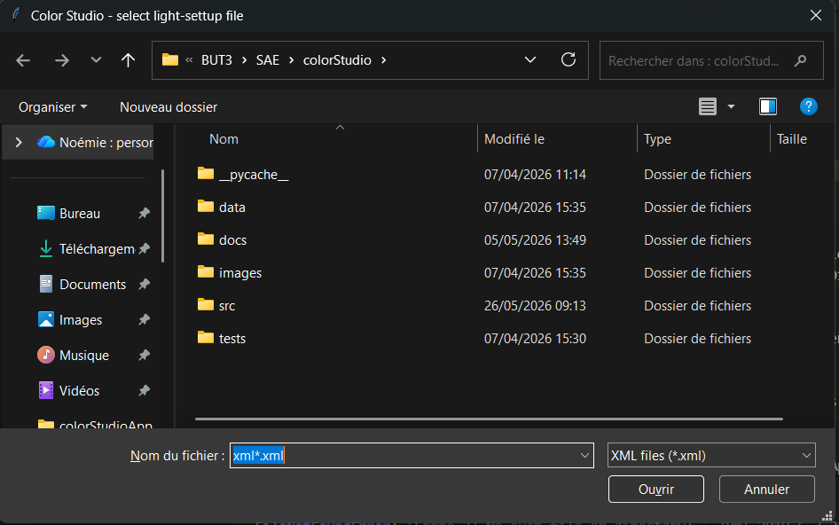
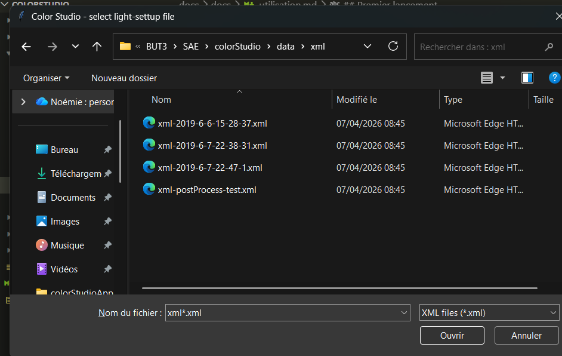
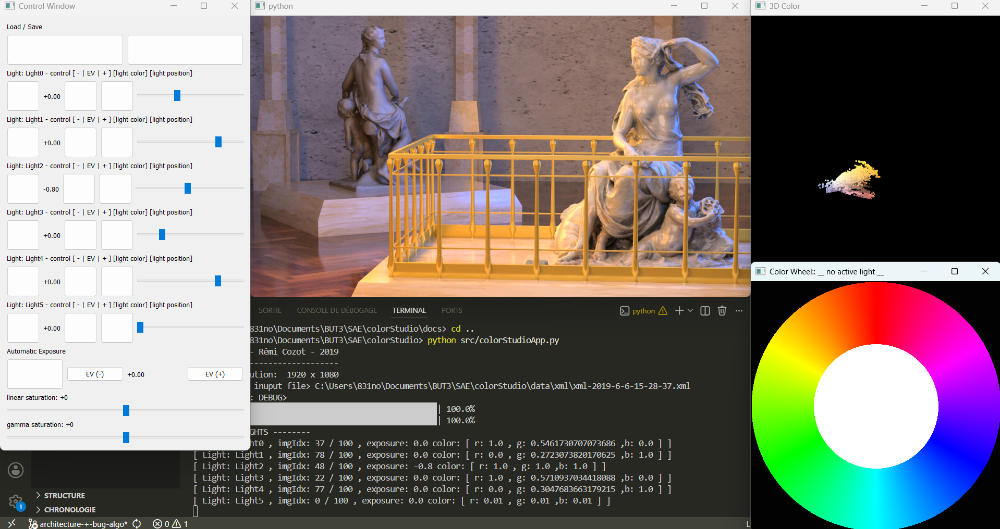

---

## Premier lancement 


1 - Lancez une première fois l'application en éxecutant :
```python src/colorStudioApp.py```

  

2 - Une fenêtre s'ouvre pour sélectionner un fichier XML

  

3 - Choisissez le fichier XML que vous souhaitez ouvrir (dans le repertoire data) :  le nom du fichier décrit la configuration des lumières (exemple : xml-2019-6-7-22-47-1.xml)

  

4 - L'interface affiche ensuite 4 fenêtres :

  

* Le rendu principal (haut gauche) : compositing des lumières
* Les contrôles (gauche) : gestion des paramètres
* Le nuage 3D (haut droit) : visualisation colorimétrique
* La roue chromatique (bas droit) : sélection des couleurs

## Contrôle des lumières    

Pour chaque lumière dans le panneau de contrôle :
x
* Slider de position : change l'indice de l'image (oriente la lumière dans l'espace)
* **Boutons EV ±** : ajuste l'exposition (luminosité) de la lumière
* Bouton couleur : active la roue chromatique pour cette lumière
* Le rendu se met à jour en temps réel


## Roue chromatique

* Cliquez sur la roue chromatique pour changer la couleur de la lumière active
* La couleur RGB s'applique immédiatement au rendu

## Sauvegarde/Chargement

* Les boutons Load/Save en haut du panneau permettent d'exporter/importer les configurations (via XML)
